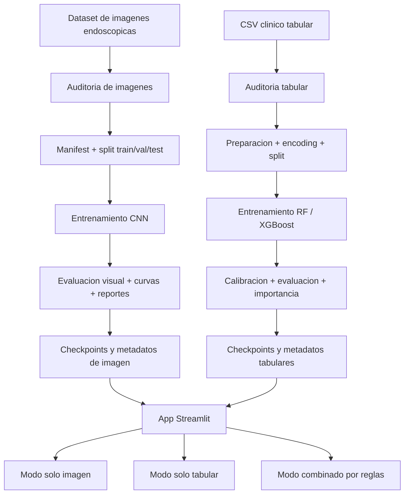

# Memoria Tecnica del Proyecto

> Nota de alcance: el indice original facilitado por el usuario parece provenir de otro proyecto de recomendacion basado en peliculas y grafos. En esta memoria se respeta la estructura solicitada, pero los contenidos se adaptan al dominio real del repositorio: prediccion multimodal academica sobre polipos y patologias relacionadas con cancer colorrectal.  
> Cuando un apartado no puede completarse a partir del codigo y artefactos versionados, se marca como `No inferible solo desde el proyecto`.  
> Cuando un apartado no aplica al caso de uso real, se marca como `No aplica en este proyecto`.  
> Cuando la carpeta o capacidad existe pero aun no esta implementada en la version actual, se marca como `Pendiente / reservado para futuras iteraciones`.

## 1. Business Understanding & Definicion del Escenario

### 1.1 Resumen Ejecutivo

El presente proyecto desarrolla un sistema academico de prediccion multimodal orientado al analisis experimental de polipos y patologias relacionadas con cancer colorrectal. Su planteamiento parte de una idea sencilla pero potente: una unica fuente de informacion rara vez captura toda la complejidad del problema. Por ello, la solucion combina dos modalidades distintas que aportan perspectivas complementarias:

- una modalidad visual, basada en imagen endoscopica
- una modalidad tabular, basada en variables clinicas estructuradas del paciente

La modalidad de imagen aborda una tarea de clasificacion multiclase en tres categorias: `polipo`, `sano` y `otras_patologias`. La modalidad tabular, en cambio, resuelve una tarea binaria de `sin_riesgo_clinico` frente a `riesgo_clinico`. Esta distincion es importante porque ambas ramas del sistema no responden exactamente a la misma pregunta, sino a dos preguntas complementarias: que sugiere la imagen y que nivel de riesgo apunta el contexto clinico estructurado.

Desde el punto de vista tecnico, el sistema se organiza en dos pipelines independientes, reproducibles y trazables. Cada pipeline contempla auditoria del dato, preparacion, entrenamiento, evaluacion y persistencia de artefactos. De esta forma, el proyecto no se limita a producir una prediccion final, sino que conserva evidencia de cada etapa en forma de manifiestos, checkpoints, curvas, historiales y reportes de evaluacion.

La capa final de explotacion se materializa en una aplicacion Streamlit que actua como interfaz de comparacion e inferencia. La app permite trabajar en tres modos:

- `Solo imagen`
- `Solo datos tabulares`
- `Combinado`

En el modo combinado no se ha implementado una fusion aprendida extremo a extremo. En su lugar, se adopta una estrategia explicable y defendible en contexto academico: la prediccion visual determina la clase final y el modelo tabular aporta una senal complementaria de riesgo clinico y de concordancia entre modalidades.

El valor del proyecto se concentra, por tanto, en tres ejes: la integracion de fuentes heterogeneas, la reproducibilidad del flujo tecnico y la interpretabilidad de los resultados. Tecnicas como `Grad-CAM` en vision y el analisis de importancia de variables en tabular no se presentan como validacion clinica, sino como mecanismos de transparencia que facilitan el analisis cualitativo del comportamiento del sistema.

### 1.2 Definicion del Escenario de Uso

El escenario de uso real de este sistema es academico, experimental y de demostracion tecnica. No se trata de una aplicacion concebida para uso asistencial real, sino de un prototipo que busca ilustrar de forma completa el ciclo de vida de una solucion de machine learning aplicada a salud: comprension del problema, preparacion del dato, modelado, evaluacion e interpretacion de resultados.

En este marco, el sistema contempla tres momentos funcionales:

Momento 1. Preparacion del dato: el proyecto parte de dos fuentes locales, una visual y otra tabular. Antes de entrenar ningun modelo, se ejecutan auditorias especificas para comprobar calidad, distribucion, consistencia y viabilidad del dato.

Momento 2. Comparacion de modelos: una vez definidos los manifiestos y las particiones `train/val/test`, se entrenan y evalua un conjunto controlado de arquitecturas por modalidad. El objetivo no es solo obtener una prediccion, sino comparar familias de modelos bajo criterios consistentes.

Momento 3. Explotacion interactiva: la app Streamlit carga los artefactos generados y permite tanto la comparacion de rendimiento como la inferencia manual sobre nuevas entradas, ya sea desde imagen, desde formulario clinico o desde ambas modalidades de forma conjunta.

Este escenario encaja especialmente bien en:

- defensas academicas
- demostraciones tecnicas
- entornos de aprendizaje sobre IA aplicada a salud
- exploracion controlada de pipelines multimodales

Tambien es importante fijar sus limites:

- no es un sistema validado clinicamente
- no se integra con HIS, RIS, PACS ni historia clinica real
- no se observa en el repositorio una arquitectura de produccion con serving desacoplado
- no existe evidencia de monitorizacion operacional o despliegue hospitalario

### 1.3 Objetivos de Negocio y Tecnicos

Siguiendo una lectura proxima a CRISP-DM, el proyecto puede descomponerse en dos capas de objetivos. La primera responde al valor que se quiere aportar como sistema. La segunda define las condiciones tecnicas necesarias para que ese valor sea sostenible y defendible.

#### A. Objetivos de Negocio

- Construir una demo academica clara, solida y visualmente defendible en el ambito de la IA aplicada a salud.
- Mostrar que la combinacion de modalidad visual y modalidad tabular aporta mas contexto que cualquiera de las dos por separado.
- Priorizar interpretabilidad y trazabilidad para que las salidas del sistema puedan explicarse con claridad.
- Traducir resultados tecnicos complejos a una interfaz comprensible para evaluadores no especialistas.

#### B. Objetivos tecnicos

- Auditar y preparar datasets heterogeneos manteniendo reproducibilidad entre ejecuciones.
- Entrenar y comparar tres CNN para imagen: `resnet50`, `efficientnet_b0` y `densenet121`.
- Entrenar y comparar dos modelos tabulares: `RandomForest` y `XGBoost`.
- Evaluar con metricas globales, metricas por clase, matrices de confusion, curvas ROC, curvas Precision-Recall y calibracion cuando aplique.
- Incorporar explicabilidad visual mediante `Grad-CAM` y explicabilidad tabular mediante importancia de variables.
- Exponer comparativa e inferencia en una app Streamlit capaz de reutilizar artefactos persistidos.

## 2. Software Architecture

### 2.1 Diagrama de Arquitectura

Capas identificadas en el repositorio:

- `Predictor_models/pipeline/image`: auditoria, preparacion, entrenamiento, evaluacion e inferencia visual.
- `Predictor_models/pipeline/tabular`: auditoria, preparacion, entrenamiento, evaluacion e inferencia tabular.
- `Predictor_models/pipeline`: utilidades comunes, metricas y configuracion.
- `Predictor_models/artifacts`: artefactos persistidos de ejecucion.
- `Predictor_models/app`: interfaz Streamlit.
- `Predictor_api`: espacio reservado para una API futura, aun no usada en la v1.

### 2.2 Justificacion del Stack Tecnologico

La seleccion tecnologica del proyecto responde a un criterio de equilibrio entre potencia tecnica, facilidad de iteracion y defendibilidad academica. No se ha buscado una arquitectura maximalista, sino una pila suficientemente robusta para resolver el problema con claridad y mantener un alto nivel de trazabilidad.

Lenguaje base:

- `Python >= 3.11`, por su posicion de referencia en ciencia de datos, computer vision y machine learning aplicado.

Gestion del entorno:

- `uv`, utilizado para sincronizar dependencias de forma simple y reproducible a partir de `pyproject.toml` y `uv.lock`.

Librerias principales:

- `torch` y `torchvision` para vision por computador, transferencia de aprendizaje e inferencia visual.
- `scikit-learn` para metricas, particionado, busqueda de hiperparametros, validacion cruzada, calibracion y `RandomForest`.
- `xgboost` para el pipeline tabular avanzado.
- `pandas` y `numpy` para preparacion y manipulacion de datos.
- `matplotlib` y `seaborn` para curvas, matrices y figuras de evaluacion.
- `streamlit` para la aplicacion de presentacion e inferencia.
- `Pillow` para carga y manejo de imagenes.
- `PyYAML` para externalizar configuracion y rutas.

La justificacion del stack tambien puede entenderse por modalidad.

En vision, el uso de CNN preentrenadas permite partir de representaciones visuales ya consolidadas y adaptarlas al dominio endoscopico mediante transferencia de aprendizaje. Esta estrategia reduce el coste de entrenamiento desde cero y ofrece un equilibrio razonable entre rendimiento, control del proceso y facilidad de explicacion.

En tabular, la naturaleza del problema favorece modelos clasicos y robustos antes que arquitecturas profundas. `RandomForest` y `XGBoost` son especialmente adecuados cuando se trabaja con variables estructuradas, tamaños de muestra moderados y necesidad de interpretabilidad. La incorporacion de `RandomizedSearchCV`, `StratifiedKFold` y calibracion `sigmoid` refuerza la madurez experimental del flujo.

En la capa de presentacion, `Streamlit` es una eleccion particularmente acertada para un proyecto de estas caracteristicas. Reduce enormemente el tiempo necesario para construir una interfaz navegable y permite centrar el esfuerzo en el valor del sistema: comparacion, interpretacion e inferencia.

Otras decisiones de diseño relevantes:

- configuracion en YAML para desacoplar parametros del codigo
- persistencia de artefactos en disco para desacoplar entrenamiento e interfaz
- separacion clara entre auditoria, preparacion, entrenamiento, evaluacion e inferencia
- integracion multimodal basada en reglas explicables, en lugar de fusion entrenada, para mantener control semantico y claridad academica

Limitaciones de arquitectura detectadas:

- `Predictor_api` esta reservada, pero no implementa aun un servicio real de inferencia
- no hay evidencia de contenedorizacion, CI/CD, observabilidad ni serving productivo
- el despliegue actual es local y monolitico

## 3. Data Understanding & Data Collection

### 3.1 Origen de Datos y Arquitectura de Ingesta

La fase de comprension del dato parte de una realidad esencial del proyecto: no existe una unica fuente homogenea, sino dos dominios de informacion claramente distintos. Por un lado, un conjunto de imagenes endoscopicas organizadas en carpetas. Por otro, un dataset tabular clinico almacenado en CSV. Esta dualidad condiciona tanto la arquitectura de ingesta como la estrategia posterior de modelado.

El proyecto trabaja con dos origenes de datos locales:

- dataset de imagenes endoscopicas bajo `Predictor_models/data/imagenes_cancer`
- dataset tabular principal `Predictor_models/data/cancer_final.csv`

La ingesta implementada es de tipo `file-based`, local y batch. No se detectan conectores a APIs externas, ni flujos continuos de eventos, ni ingestion en tiempo real. En el contexto de este trabajo, esta decision es completamente coherente: el objetivo principal no es la operacion online del sistema, sino la reproducibilidad del flujo experimental y la trazabilidad del dato.

La salida de esta arquitectura de ingesta no son simplemente tensores o dataframes en memoria, sino estructuras intermedias reutilizables:

- manifiestos consolidados
- resumentes de particion
- reportes de auditoria

De este modo, cada etapa posterior trabaja sobre una representacion controlada y persistida del dato, en lugar de depender continuamente del estado bruto de las carpetas o CSV originales.

### 3.1.1 Seleccion de Fuentes Clinicas y Estructura de Captura

El repositorio no implementa integracion con APIs externas tipo REST o GraphQL. Toda la captura de informacion se apoya en fuentes locales organizadas por modalidad, lo que simplifica el despliegue y refuerza la reproducibilidad.

Fuentes presentes en imagen:

- `Casos_negativos`
- `Polipos/polyps`
- `Polipos/imagenes con polipos destacados/output/original`
- `Sangre_Paredes`

Fuentes presentes en tabular:

- `cancer_final.csv`
- CSV de preguntas utilizado para construir el formulario de paciente

La seleccion de estas fuentes responde a una logica funcional clara:

- separar evidencia visual y evidencia clinica estructurada
- construir una tarea visual multiclase y una tarea tabular binaria complementaria
- permitir una ejecucion completa del pipeline con recursos locales

Desde un punto de vista metodologico, esta estructura es adecuada para un proyecto academico porque reduce dependencias operativas externas y facilita reconstruir el flujo de punta a punta con un entorno controlado.

### 3.2 Analisis Exploratorio (EDA) - Datos Crudos

#### 3.2.1 Inventario del dataset consolidado

La auditoria visual versionada en artefactos reporta un total de `5953` imagenes auditadas, `14` posibles grupos de duplicados y `0` archivos potencialmente corruptos. Estas cifras no deben leerse como un mero recuento, sino como un primer filtro de calidad: antes de plantear cualquier entrenamiento, el proyecto confirma que la base de partida es estructuralmente consumible.

La distribucion por clase en imagen es:

- `polipo`: `2298`
- `sano`: `2000`
- `otras_patologias`: `1655`

Y la distribucion por fuente:

- `Polipos/polyps`: `500`
- `Polipos/imagenes con polipos destacados/output/original`: `1798`
- `Casos_negativos`: `2000`
- `Sangre_Paredes`: `1655`

En la modalidad tabular, la auditoria recoge `10131` filas, con la siguiente distribucion del target:

- `sin_riesgo_clinico`: `8050`
- `riesgo_clinico`: `2081`

Este inventario permite ya una primera conclusion: el proyecto dispone de un volumen razonable para abordar ambas modalidades con tecnicas supervisadas, pero las caracteristicas de cada una son muy diferentes. La imagen presenta varias subfuentes con posible heterogeneidad de dominio, mientras que el tabular muestra un desbalance claro de la clase positiva.

#### 3.2.2 Distribucion de clases en imagen

La distribucion visual observada en la auditoria puede considerarse relativamente equilibrada, aunque no perfectamente simetrica. `Polipo` es la clase mas representada, seguida de `sano`, mientras `otras_patologias` presenta un numero algo menor de muestras. Esta situacion no constituye un problema severo de desbalance, pero si justifica ciertas precauciones metodologicas.

En particular, el pipeline incorpora pesos de clase en la funcion de perdida y prioriza metricas macro como `f1_macro`, precisamente para evitar que una buena accuracy global oculte un peor rendimiento en clases menos representadas.

Ademas, la experiencia del proyecto sugiere que en vision la dificultad no depende solo del volumen agregado por clase. La heterogeneidad entre subfuentes puede tener un impacto igual o mayor. Dos clases con tamaños parecidos pueden presentar dificultades muy distintas si una de ellas concentra mayor variabilidad visual, peores condiciones de captura o dominios mas alejados entre si.

#### 3.2.3 Distribucion de la variable objetivo tabular

La modalidad tabular presenta un desbalance mucho mas claro que la visual. La clase `sin_riesgo_clinico` cuadruplica aproximadamente a `riesgo_clinico`, lo que obliga a interpretar con cuidado cualquier metrica agregada.

En este contexto, una accuracy elevada por si sola no seria suficiente para validar el comportamiento del modelo, ya que un clasificador poco sensible a la clase positiva podria seguir obteniendo una buena puntuacion global. Por esta razon, el pipeline tabular centra la evaluacion en metricas orientadas a la clase de riesgo:

- `precision_positive`
- `recall_positive`
- `f1_positive`

Tambien se observa una adaptacion tecnica coherente en `XGBoost`, donde `scale_pos_weight` se calcula segun el reparto real de clases en entrenamiento para compensar el desbalance observado.

#### 3.2.4 Cobertura de metadatos

Una de las fortalezas del proyecto es que no se limita a consumir archivos crudos, sino que construye metadatos utiles para el pipeline y la evaluacion posterior.

En imagen se dispone de:

- ruta del fichero
- clase
- fuente de origen
- nombre de fichero
- `group_id` basado en hash parcial
- split asignado

En tabular se dispone de:

- `id`
- edad
- sexo
- sintomas y antecedentes codificados
- variable objetivo `cancer_diagnosis`
- agrupacion normalizada de antecedentes digestivos
- variables one-hot derivadas
- split asignado

La importancia de estos metadatos es alta. En imagen, por ejemplo, `group_id` ayuda a reducir fugas entre particiones. En tabular, la agrupacion de antecedentes digestivos y la expansion `one-hot` son esenciales para transformar valores clinicos heterogeneos en una representacion robusta para el modelo.

Hay, ademas, un hallazgo funcional relevante: el reporte tabular indica que falta `age` como variable en el CSV de preguntas. Lejos de romper el flujo, el codigo la inserta por defecto en la construccion del formulario. Este comportamiento ilustra una idea central del proyecto: detectar incoherencias entre capas y resolverlas con diseno defensivo.

#### 3.2.5 El problema de las 61K imagenes sin clasificar

El documento `Predictor_models/ESTRUCTURA_DATOS.md` evidencia una limitacion importante del ecosistema de datos: existe una bolsa de `61.957` imagenes sin clasificar. Aunque estas muestras no participan en el entrenamiento actual, su presencia es significativa porque marca a la vez una carencia y una oportunidad.

La carencia es evidente: el modelo solo aprende sobre el subconjunto etiquetado y deja fuera una gran masa de informacion potencialmente valiosa. Pero esa misma situacion abre varias lineas de trabajo futuras:

- curacion manual o asistida
- pseudoetiquetado
- aprendizaje semisupervisado
- deteccion de outliers o dominios no cubiertos

Por tanto, este apartado no debe leerse solo como una limitacion del dataset actual, sino como una reserva clara de crecimiento para el proyecto.

#### 3.2.6 Distribucion demografica de usuarios

`No inferible solo desde el proyecto`.

El repositorio no incluye un estudio demografico completo de pacientes o cohortes. No obstante, si puede recuperarse informacion parcial a partir de la distribucion de `digestive_family_history_group`, que sirve como aproximacion muy limitada al perfil clinico estructurado:

- `no`: `8686`
- `colon`: `604`
- `gastric`: `464`
- `other_positive`: `374`
- `unknown_dirty`: `3`

Esta informacion no sustituye un verdadero analisis demografico, pero si aporta una primera lectura sobre la composicion del dato tabular.

## 4. Data Preparation & Feature Engineering

### 4.1 Pipeline de Preparacion de Datos: De fuentes locales a artefactos reproducibles

La preparacion de datos constituye una de las partes mas consistentes del proyecto. Lejos de resolver el problema con una cadena improvisada de scripts, el sistema establece una ETL local que transforma fuentes heterogeneas en estructuras de trabajo persistidas, trazables y reutilizables.

El flujo general contempla:

- lectura de carpetas de imagen y CSV clinicos
- auditoria y deteccion de problemas de calidad
- normalizacion de estructura y etiquetas
- generacion de manifiestos y particiones persistidas
- produccion de artefactos listos para entrenamiento y evaluacion

No se utilizan en esta version:

- APIs externas
- PostgreSQL
- data lake
- motores de streaming

Esta simplicidad arquitectonica no resta calidad al proyecto; al contrario, refuerza su reproducibilidad y hace mas transparente la cadena de transformacion del dato.

### 4.1.1 Pipeline 01: Auditoria y manifiesto de imagen

El primer pipeline visual cumple una funcion fundacional: convertir un conjunto de carpetas y archivos en una representacion estable del dataset. Para ello realiza descubrimiento recursivo de imagenes, identifica formatos, detecta posibles corrupciones y calcula un `group_id` mediante hash parcial.

Este `group_id` es especialmente importante porque permite agrupar muestras potencialmente equivalentes y reducir el riesgo de fuga entre particiones. En un dominio visual, donde pueden existir duplicados, variantes o capturas casi identicas, esta precaucion tiene un valor metodologico real.

Sus principales salidas son:

- `Predictor_models/artifacts/manifests/dataset_manifest.csv`
- `Predictor_models/artifacts/manifests/splits.json`
- `Predictor_models/artifacts/reports/dataset_audit.json`
- `Predictor_models/artifacts/reports/dataset_audit.md`

Este pipeline no solo "prepara para entrenar"; tambien documenta el estado del dato y establece una base auditable para interpretar resultados posteriores.

### 4.1.2 Pipeline 02: Preparacion del dataset tabular

La preparacion tabular sigue una filosofia equivalente, adaptada al dato estructurado. El flujo comienza con la lectura del CSV principal usando separador y encoding configurables, continua con la limpieza de columnas y la transformacion del target `yes/no -> 1/0`, y finaliza con la construccion de una representacion numerica consistente para el modelo.

Entre las transformaciones mas relevantes destacan:

- codificacion de sexo
- conversion de columnas binarias
- mantenimiento de ordinales como enteros
- agrupacion semantica de `digestive_family_history`
- expansion posterior en variables `one-hot`

Las salidas principales son:

- `Predictor_models/artifacts/tabular/manifests/tabular_manifest.csv`
- `Predictor_models/artifacts/tabular/reports/tabular_dataset_audit.json`
- `Predictor_models/artifacts/tabular/reports/tabular_split_summary.json`

Uno de los aspectos mejor resueltos es que el pipeline no solo transforma valores: tambien registra inconsistencias, identifica columnas ausentes o inesperadas y cruza el dataset con el formulario mostrado en la app. De este modo, la preparacion de datos se convierte tambien en una forma de validacion funcional.

### 4.1.3 Pipeline 03: Entrenamiento y evaluacion visual

El flujo visual consume el manifiesto previamente generado y opera sobre una estructura ya controlada. Esto permite que la etapa de entrenamiento se centre realmente en el modelado y no en el caos del dato bruto.

El pipeline realiza:

- carga del manifiesto visual
- construccion de transforms diferenciadas para entrenamiento y evaluacion
- entrenamiento con transferencia de aprendizaje
- early stopping
- guardado de checkpoints, historiales y metadatos
- evaluacion final sobre `test`

La separacion entre entrenamiento y evaluacion es especialmente valiosa porque permite reutilizar checkpoints y revisar experimentos sin necesidad de repetir todo el proceso de ajuste.

### 4.1.4 Pipeline 04: Entrenamiento y evaluacion tabular

El pipeline tabular muestra una madurez experimental especialmente destacable para un proyecto academico. Sobre el manifiesto ya preparado, se seleccionan las variables codificadas, se lanza una busqueda de hiperparametros mediante `RandomizedSearchCV`, se aplica validacion cruzada estratificada y, una vez elegido el mejor estimador, se calibra la salida probabilistica.

El flujo incorpora:

- seleccion de variables codificadas
- busqueda de hiperparametros con `RandomizedSearchCV`
- validacion cruzada estratificada
- calibracion de probabilidades
- evaluacion final con metricas, curvas e importancia de variables

Esto eleva el pipeline por encima de un entrenamiento tabular basico y acerca el proyecto a una metodologia experimental solida.

### 4.2 Enriquecimiento demografico de usuarios

`No aplica en el sentido original del indice`.

El equivalente funcional, en este proyecto, no es un enriquecimiento de usuarios de plataforma sino la normalizacion clinica del perfil tabular del paciente. Bajo esta lectura, el pipeline transforma variables heterogeneas en una representacion coherente y util para el modelo.

En concreto:

- `sex` se codifica como `woman -> 0`, `man -> 1`
- las columnas binarias se convierten de `yes/no` a `1/0`
- las columnas ordinales (`alcohol`, `tobacco`, `intestinal_habit`) se fuerzan a formato numerico
- `digestive_family_history` se agrupa en:
  - `no`
  - `colon`
  - `gastric`
  - `other_positive`
  - `unknown_dirty`
- dicha agrupacion se convierte despues en variables `one-hot`

Esta transformacion reduce ambiguedad semantica, mejora la estabilidad del modelado y permite interpretar mejor el peso de cada bloque de informacion.

### 4.3 Generacion de splits reproducibles

La reproducibilidad del sistema depende en gran medida de como se generan las particiones. En imagen, el pipeline utiliza un `group_id` basado en hash parcial para minimizar que muestras practicamente equivalentes se repartan entre train y test. Despues, genera particiones persistidas `train`, `val` y `test`.

En tabular, el criterio es distinto pero igualmente riguroso:

- se aplica `train_test_split` estratificado
- primero se separa `test`
- despues se divide `train/val` manteniendo proporcion de clases

Esta estrategia garantiza comparabilidad entre ejecuciones y evita que cambios accidentales en el reparto de datos invaliden las comparativas entre modelos.

### 4.4 Persistencia de artefactos y estructura de salida

El proyecto no entiende el entrenamiento como un proceso efimero, sino como una fabrica de artefactos reutilizables. Cada etapa deja salidas persistidas que pueden inspeccionarse, reutilizarse y conectarse con otras partes del sistema.

### 4.4.1 Principio de diseno

El principio general es que cada fase produzca ficheros consumibles por la siguiente:

- auditoria -> reportes
- preparacion -> manifiestos y splits
- entrenamiento -> checkpoints e historiales
- evaluacion -> metricas y figuras
- app -> lectura directa de artefactos persistidos

Gracias a este diseno, la interfaz no necesita reentrenar modelos ni recalcular datasets para funcionar. Solo necesita leer los artefactos adecuados.

### 4.4.2 Tipos de artefactos generados

Los artefactos principales del proyecto incluyen:

- manifiestos `.csv`
- resumentes de split `.json`
- auditorias `.json` y `.md`
- checkpoints `.pt` y `.pkl`
- historiales `.json`
- evaluaciones `.json`
- figuras `.png`

Cada tipo de artefacto cumple una funcion distinta: algunos soportan entrenamiento, otros evaluacion, otros interpretacion y otros presentacion en la app.

### 4.4.3 Relacion entre artefactos y etapas

Las relaciones funcionales mas importantes son:

- el manifiesto visual alimenta entrenamiento y evaluacion de CNN
- el manifiesto tabular alimenta entrenamiento y evaluacion tabular
- los checkpoints alimentan inferencia y app
- los metadatos permiten descubrir automaticamente que modelos estan disponibles

Esta estructura hace que el sistema sea modular incluso sin necesidad de microservicios ni bases de datos intermedias.

### 4.4.4 Propiedades computadas en la preparacion

Durante la preparacion se calculan propiedades que ya forman parte del valor del sistema:

- `group_id` visual por hash
- `split`
- codificaciones binarias
- codificaciones ordinales
- `digestive_family_history_group`
- variables `one-hot` derivadas

Estas propiedades son las que convierten un dato bruto en un dato utilizable y metodologicamente controlado.

## 5. Modeling & Forecasting

### 5.1 Seleccion de la arquitectura: Por que multimodalidad?

La principal decision de modelado del proyecto no es la adopcion de una unica familia de algoritmos, sino la eleccion de una estrategia multimodal. En el dominio endoscopico, una sola fuente rara vez agota el problema: la imagen aporta morfologia, textura, color y contexto espacial, mientras que el tabular introduce antecedentes, sintomas y habitos clinicamente relevantes.

Por esta razon, la arquitectura se apoya en tres piezas:

- vision mediante CNN con transferencia de aprendizaje
- modelado tabular supervisado con algoritmos clasicos
- integracion final mediante reglas explicables en la app

La justificacion de esta arquitectura es fuerte en el contexto del proyecto:

- la imagen aporta evidencia morfologica directa
- el tabular aporta contexto clinico estructurado
- ambas modalidades cubren senales distintas y complementarias
- la estrategia permite una demo interpretable y defendible sin exigir una fusion multimodal profunda desde la primera iteracion

### 5.2 Modelo 1: Clasificacion visual con CNN

La modalidad de imagen resuelve una clasificacion multiclase:

- `polipo`
- `sano`
- `otras_patologias`

Modelos comparados:

- `resnet50`
- `efficientnet_b0`
- `densenet121`

### 5.2.1 Transfer learning sobre backbones preentrenados

La estrategia visual adoptada se basa en transferencia de aprendizaje. En lugar de entrenar una CNN desde cero, el proyecto parte de backbones ya preentrenados y los adapta al dominio concreto de las imagenes endoscopicas.

La secuencia observada en el codigo es:

- inicializar un backbone preentrenado
- congelar inicialmente la red base
- entrenar la cabeza clasificadora
- desbloquear despues toda la red para fine-tuning

Este enfoque ofrece dos ventajas claras. Por un lado, acelera la convergencia y estabiliza las primeras etapas de entrenamiento. Por otro, permite aprovechar representaciones visuales generales ya aprendidas, algo especialmente util cuando el dataset disponible, aunque consistente, no justifica entrenar desde inicializacion aleatoria.

### 5.2.2 Funcionamiento del pipeline visual

El pipeline visual no se reduce a un simple bucle de entrenamiento. Su estructura incorpora varias decisiones que refuerzan la calidad metodologica:

- lectura desde manifiesto, no desde carpetas arbitrarias en cada ejecucion
- transforms diferenciadas para entrenamiento y evaluacion
- optimizacion con `AdamW`
- scheduler `ReduceLROnPlateau`
- `CrossEntropyLoss` con pesos de clase
- early stopping segun `f1_macro`

Ademas, la configuracion incluye una mascara en la esquina inferior izquierda de la imagen, lo que sugiere una medida defensiva orientada a reducir atajos visuales o artefactos sistematicos en esa zona.

### 5.2.3 Artefactos generados por el modelo visual

Para cada CNN el sistema no guarda solo el mejor peso, sino un conjunto de artefactos que hacen trazable el experimento:

- checkpoint `.pt`
- historial de entrenamiento `.json`
- metadatos `.json`
- evaluacion `.json`
- curva ROC
- curva PR
- matriz de confusion

Esta persistencia es esencial porque permite comparar arquitecturas, reutilizar modelos y revisar condiciones de entrenamiento sin necesidad de repetir ejecuciones completas.

### 5.2.4 Parametros principales

Configuracion base observada:

- `image_size`: `224`
- `batch_size`: `16`
- `epochs`: `20`
- `learning_rate`: `0.0003`
- `weight_decay`: `0.0001`
- `primary_metric`: `f1_macro`
- `early_stopping_patience`: `5`

### 5.3 Modelo 2: Clasificacion tabular de riesgo clinico

La modalidad tabular resuelve una clasificacion binaria:

- `sin_riesgo_clinico`
- `riesgo_clinico`

Los modelos comparados son:

- `RandomForest`
- `XGBoost`

Se trata de una eleccion muy razonable para un problema con variables estructuradas, tamaño de muestra suficiente y necesidad de interpretabilidad. En escenarios tabulares de este tipo, modelos basados en arboles suelen ofrecer un equilibrio excelente entre rendimiento, robustez y explicabilidad.

### 5.3.1 Variables de entrada y representacion

Variables principales:

- `age`
- `sex`
- `sof`
- `alcohol`
- `tobacco`
- `diabetes`
- `tenesmus`
- `previous_rt`
- `rectorrhagia`
- `intestinal_habit`
- `digestive_family_history`

Tras la preparacion se usan variables codificadas numericamente y `one-hot`.

### 5.3.2 Busqueda de hiperparametros y validacion

El pipeline tabular incorpora varias buenas practicas que elevan claramente su madurez experimental:

- `StratifiedKFold`
- `RandomizedSearchCV`
- seleccion por `f1`
- calibracion posterior con metodo `sigmoid`

Esta combinacion es especialmente importante en un dataset desbalanceado. La validacion cruzada reduce la dependencia de una sola particion, la busqueda de hiperparametros evita configuraciones arbitrarias y la calibracion mejora la interpretacion probabilistica de la salida final mostrada en la app.

### 5.3.3 Interpretabilidad tabular

La evaluacion tabular guarda:

- importancia nativa del modelo
- importancia por permutacion
- curvas ROC y PR
- curva de calibracion
- alertas por subgrupo

### 5.4 Modelo 3: Integracion multimodal basada en reglas

La integracion actual no es una fusion aprendida. Se trata de una capa de decision explicable construida sobre dos salidas independientes. Desde el punto de vista academico, esta decision es acertada: sacrifica sofisticacion algoritimica a cambio de transparencia, control semantico y facilidad de defensa.

### 5.4.1 Calculo de la decision combinada

La logica implementada es:

- la imagen determina la clase visual final
- el tabular estima la probabilidad de `riesgo_clinico`
- una funcion de reglas interpreta la concordancia entre ambas senales

### 5.4.2 Escenarios de concordancia

Se generan mensajes como:

- `Concordancia favorable`
- `Concordancia parcial con alerta`
- `Concordancia alta`
- `Concordancia baja`

### 5.4.3 Uso en el sistema

Esta integracion se usa unicamente en la app Streamlit, dentro del modo `Combinado`.

### 5.5 Explicabilidad del sistema

La explicabilidad se aborda de forma adaptada a cada modalidad:

- Imagen: `Grad-CAM`
- Tabular: importancia de variables e importancia por permutacion

Esta diferenciacion es importante porque evita forzar una tecnica unica sobre modelos y datos que tienen naturalezas muy distintas.

### 5.5.1 Explicabilidad visual con Grad-CAM

La app superpone un mapa de activacion sobre la imagen subida por el usuario para resaltar las regiones que mas contribuyen a la prediccion. Es importante enmarcar correctamente esta tecnica: `Grad-CAM` no valida clinicamente la localizacion exacta de una lesion ni actua como segmentacion formal, pero si cumple una funcion muy valiosa de interpretabilidad post-hoc.

En este proyecto, su utilidad principal es doble:

- aumentar la transparencia del prototipo ante evaluadores o usuarios tecnicos
- facilitar el analisis cualitativo de errores y posibles atajos visuales del modelo

### 5.5.2 Explicabilidad tabular basada en importancia

Se muestran las variables mas influyentes para ayudar a interpretar por que el modelo asigna mayor o menor riesgo.

### 5.6 Limitaciones del enfoque de modelado actual

El proyecto obtiene resultados muy buenos, pero su alcance debe delimitarse con honestidad. Las principales limitaciones metodologicas son:

- no hay fusion multimodal entrenada
- no existe correspondencia paciente-imagen validada dentro del repositorio
- la salida tabular es binaria y no distingue tipo patologico exacto
- no hay validacion externa clinica

Estas limitaciones no invalidan el sistema, pero si acotan con precision el tipo de conclusiones que puede sostenerse a partir de el.

### 5.7 Arquitectura de la Homepage

La homepage real corresponde a la app Streamlit y se organiza en dos grandes pestanas:

- `Comparativa`
- `Prediccion`

Dentro de `Comparativa`:

- Tab `Modelos de imagen`
- Tab `Modelos tabulares`

Dentro de `Prediccion`:

- `Solo imagen`
- `Solo datos tabulares`
- `Combinado`

Capacidades visibles:

- Seleccion independiente de modelo visual y tabular.
- Tabla comparativa de metricas por modalidad.
- Graficos de barras para comparar modelos.
- Curvas ROC, PR, matriz de confusion y calibracion donde aplica.
- Subida de imagen para inferencia.
- Formulario guiado para variables clinicas.
- `Grad-CAM` para interpretacion visual.
- Interpretacion conjunta basada en concordancia entre modalidades.

### 5.7.1 Mix Strategy Adaptativo

En esta version la estrategia de mezcla es simple y explicable:

- La imagen determina la clase final entre `polipo`, `sano` y `otras_patologias`.
- El modelo tabular estima `riesgo_clinico`.
- Una funcion de reglas devuelve un mensaje de concordancia:
  - `Concordancia favorable`
  - `Concordancia parcial con alerta`
  - `Concordancia alta`
  - `Concordancia baja`

No hay:

- meta-modelo de fusion
- stacking
- aprendizaje conjunto
- optimizacion de pesos entre modalidades

## 6. Evaluation & Analysis of Results

Este apartado recoge la lectura tecnica de los resultados obtenidos a partir de los artefactos versionados. Conviene subrayar que el objetivo aqui no es solo enumerar metricas, sino interpretarlas en el contexto del proyecto: que modelos funcionan mejor, que patrones de error aparecen y que limites tiene la validez de las conclusiones.

### 6.1 Resultados de imagen

La comparativa de modelos visuales muestra un rendimiento notablemente alto en las tres arquitecturas evaluadas:

| Modelo | Accuracy | Recall macro | F1 macro | ROC-AUC | PR-AUC |
|---|---:|---:|---:|---:|---:|
| `resnet50` | 0.9877 | 0.9880 | 0.9877 | 0.9993 | 0.9987 |
| `densenet121` | 0.9855 | 0.9859 | 0.9860 | 0.9996 | 0.9993 |
| `efficientnet_b0` | 0.9799 | 0.9804 | 0.9803 | 0.9996 | 0.9993 |

Observaciones:

- `resnet50` obtiene el mejor `F1 macro` y la mejor `accuracy`.
- `densenet121` queda muy cerca y tambien muestra un rendimiento excelente.
- Los tres modelos presentan AUC muy altas, lo que sugiere una fuerte capacidad de separacion entre clases sobre el conjunto de prueba actual.

Desde una lectura academica, estos resultados son muy positivos, pero tambien exigen cautela. Un rendimiento tan alto puede interpretarse como evidencia de que la tarea, tal como esta construida en este dataset, es muy separable para las CNN seleccionadas. Sin embargo, eso no equivale automaticamente a generalizacion clinica fuera del dominio actual. Precisamente por ello, el analisis por fuente y por errores concretos adquiere especial importancia.

Detalle del mejor modelo visual versionado (`resnet50`):

- Accuracy: `0.9877`
- F1 macro: `0.9877`
- Errores mas frecuentes:
  - `polipo -> otras_patologias`: `4`
  - `sano -> polipo`: `3`
  - `otras_patologias -> polipo`: `2`

Hallazgos por fuente:

- La fuente `Polipos/polyps` presenta la mayor tasa de error relativa.
- La fuente consolidada `output/original` presenta error muy bajo.
- Esto sugiere que la heterogeneidad entre subfuentes influye de forma directa en la dificultad real del problema.

Este punto es especialmente relevante, porque desplaza el foco desde la clase hacia el dominio de adquisicion. En problemas de imagen medica, la procedencia de la muestra puede afectar tanto como la etiqueta, y el proyecto lo refleja de forma explicita en sus reportes.

### 6.2 Resultados tabulares

La comparativa tabular tambien ofrece un comportamiento fuerte y consistente:

| Modelo | Accuracy | Precision positiva | Recall positivo | F1 positivo | ROC-AUC | PR-AUC | CV best |
|---|---:|---:|---:|---:|---:|---:|---:|
| `xgboost` | 0.9342 | 0.8155 | 0.8782 | 0.8457 | 0.9735 | 0.9129 | 0.8620 |
| `random_forest` | 0.9329 | 0.8125 | 0.8750 | 0.8426 | 0.9732 | 0.9090 | 0.8716 |

Observaciones:

- `xgboost` es el mejor modelo tabular en test por `F1 positivo`.
- `random_forest` obtiene mejor score medio de CV, pero queda ligeramente por debajo en test.
- Ambos modelos muestran rendimiento alto para un escenario tabular binario y desbalanceado.

Este resultado es interesante porque recuerda una leccion metodologica importante: el mejor rendimiento medio en validacion cruzada no siempre coincide exactamente con el mejor comportamiento final en test. Por eso es especialmente util conservar ambas lecturas y no reducir toda la comparativa a una unica cifra.

Detalle del mejor modelo tabular versionado (`xgboost`):

- Accuracy: `0.9342`
- Precision positiva: `0.8155`
- Recall positivo: `0.8782`
- F1 positivo: `0.8457`
- ROC-AUC: `0.9735`
- PR-AUC: `0.9129`

Variables mas influyentes:

- Importancia nativa:
  - `rectorrhagia`
  - `sof`
  - `tenesmus`
  - `intestinal_habit`

- Importancia por permutacion:
  - `rectorrhagia`
  - `age`
  - `sof`
  - `tenesmus`

Interpretacion:

- `rectorrhagia` domina claramente la senal predictiva.
- La edad gana relevancia en la importancia por permutacion, lo que la convierte en una variable estructural aunque su importancia nativa sea menor.

Esta lectura es valiosa porque conecta el comportamiento del modelo con variables clinicamente comprensibles. Al mismo tiempo, obliga a vigilar que el modelo no dependa de forma excesiva de una sola senal dominante.

### 6.3 Lectura critica de los resultados

En conjunto, los resultados del proyecto son tecnicamente muy satisfactorios. Ambas modalidades alcanzan un nivel alto de rendimiento, el proceso experimental esta bien estructurado y la interfaz permite explotar e interpretar los modelos de forma clara.

Las principales fortalezas del sistema son:

- buen rendimiento en ambas modalidades
- reproducibilidad apoyada en manifiestos y artefactos
- capacidad de explicabilidad tanto visual como tabular
- app capaz de integrar comparativa, inferencia e interpretacion

No obstante, una lectura rigurosa exige mantener varias cautelas:

- no hay validacion externa clinica
- la fusion multimodal es reglada, no aprendida
- los datos de imagen no estan versionados en Git y dependen de estructura local
- el dataset tabular resuelve `riesgo_clinico`, no una taxonomia completa de patologias

Por tanto, el proyecto debe interpretarse como un prototipo tecnico de alto valor academico y demostrativo, no como un sistema listo para despliegue clinico real.

## 7. Deployment: UX/UI & Prototipo

### 7.1 Diseno Interfaz y Arquitectura Visual

La interfaz desarrollada en Streamlit no debe entenderse como un simple complemento visual del proyecto, sino como la capa que traduce los artefactos del pipeline en una experiencia de uso comprensible. En ese sentido, la app actua como un panel tecnico de demostracion e interpretacion.

Su diseño responde a una filosofia funcional y academica:

- seleccion de modelos desde artefactos detectados en disco
- visualizacion tabular y grafica de metricas
- flujo de inferencia guiado y de baja friccion
- exposicion clara de confianza, probabilidades y curvas

El patron de despliegue actual es deliberadamente simple:

- aplicacion monolitica local
- sin backend API obligatorio
- carga de checkpoints directamente desde disco

Lejos de ser una limitacion en este contexto, esta eleccion reduce complejidad y favorece la claridad de la demo.

### 7.2 Interpretacion Visual y Dashboards de Recomendacion

`No aplica en el sentido de recomendacion`.

Adaptacion al caso real:

- La app actua como dashboard de evaluacion y prediccion clinico-experimental.

### 7.2.1 Carruseles Personalizados (Homepage)

`No aplica en este proyecto`.

### 7.2.2 Inteligencia de Comunidad (Compatibilidad)

`No aplica en este proyecto`.

### 7.2.3 Flujo de Onboarding Guiado

El onboarding real del sistema es mucho mas simple que el de una plataforma de producto final, pero aun asi cumple una funcion importante: orientar al usuario en el uso correcto del prototipo. El flujo basico consiste en:

- seleccionar modelo de imagen
- seleccionar modelo tabular
- elegir modo de uso
- subir una imagen y/o completar el formulario

No existe un onboarding multi-paso persistente ni un tutorial embebido formal. Sin embargo, si hay una forma de guiado implicita: la interfaz restringe y ordena las acciones necesarias para cada modo, y el formulario se construye a partir de especificaciones versionadas.

### 7.3 Casos de uso y escenarios de usuario

Caso 1. Comparacion academica de modelos:

- El usuario abre la pestana `Comparativa`.
- Revisa tablas, metricas, curvas y matrices.
- Decide que arquitectura defender o reentrenar.

Caso 2. Inferencia solo visual:

- El usuario sube una imagen endoscopica.
- Obtiene clase, confianza y `Grad-CAM`.

Caso 3. Inferencia solo tabular:

- El usuario completa el formulario clinico.
- Obtiene clase binaria de riesgo y probabilidades.

Caso 4. Interpretacion combinada:

- El usuario aporta imagen y datos tabulares.
- El sistema muestra ambas salidas y un mensaje de concordancia.

### 7.4 Robustez y Diseno Defensivo (Error Handling UX)

Aunque la app no esta orientada a produccion, si incorpora varias decisiones de degradacion elegante. El sistema no asume que todos los artefactos o entradas estaran siempre disponibles, sino que comunica estados de ausencia o error de forma comprensible.

Elementos presentes:

- mensajes `st.error`, `st.warning` e `st.info` cuando faltan modelos o falla la inferencia
- deteccion de checkpoints no disponibles
- carga segura de JSON de metadatos
- insercion automatica de la pregunta de edad si falta en el CSV de preguntas

Elementos no observados:

- validacion avanzada de formatos de entrada
- telemetria de errores
- reintentos automaticos
- logging estructurado orientado a produccion

## 8. Quality Assurance & Technical Specifications

### 8.1 Estrategia de Testing

La estrategia de calidad del proyecto no se apoya principalmente en una suite convencional de `pytest`, sino en una combinacion de auditoria de datos, control de reproducibilidad y evaluacion cuantitativa persistida. En otras palabras, la calidad se asegura mas por la disciplina del pipeline que por una capa formal de testing automatizado.

Los pilares observables son:

- auditoria de dataset
- manifiestos reproducibles
- comparacion controlada de modelos
- evaluacion cuantitativa y generacion de figuras

No se observan suites tradicionales de `pytest` en el repositorio actual.

### 8.1.1 Tipologia de Pruebas Implementadas

Implementadas de forma efectiva:

- Auditoria de calidad del dataset de imagen.
- Auditoria del dataset tabular y del formulario.
- Evaluacion hold-out en `test`.
- Validacion cruzada estratificada para modelos tabulares.
- Calibracion del modelo tabular.
- Analisis por fuente o subgrupo.
- Interpretabilidad visual mediante `Grad-CAM`.

No implementadas como pruebas automatizadas de repo:

- unit tests
- integration tests
- end-to-end tests
- smoke tests CI

### 8.1.2 Analisis de Cobertura (Code Coverage)

`No inferible solo desde el proyecto`.

Motivo:

- No hay configuracion de `pytest-cov`, `coverage` ni reportes de cobertura versionados.

### 8.1.3 Robustez y Resiliencia (Utility Testing)

Aunque no exista una suite formal de pruebas de utilidades, si pueden identificarse evidencias claras de diseño defensivo:

- `dependency_guard` para detectar dependencias ausentes
- `resolve_path` y utilidades comunes para rutas reproducibles
- control de semillas mediante `set_seed`
- carga tolerante de encoding en el CSV de preguntas
- deteccion de valores inesperados en el pipeline tabular
- deteccion de archivos corruptos o duplicados potenciales en imagen

Estas decisiones no sustituyen a un sistema formal de testing, pero si demuestran preocupacion real por robustez operativa.

### 8.2 Estructura del Codigo

#### 8.2.1 Capa de Presentacion (/App)

- Ruta real: `Predictor_models/app/app.py`
- Responsabilidades:
  - descubrir modelos disponibles
  - mostrar comparativas
  - construir formularios
  - ejecutar inferencia
  - renderizar interpretacion multimodal

#### 8.2.2 Capa de Datos (/Data)

`No totalmente visible en Git`.

Lo inferible:

- `Predictor_models/data/imagenes_cancer` es la raiz del dataset visual esperado.
- `Predictor_models/data/cancer_final.csv` es el dataset tabular principal.
- `Predictor_models/data/...Preguntas...csv` alimenta el formulario.

Observacion:

- El contenido bruto de `data/` no esta versionado en el repositorio publicado.

#### 8.2.3 Nucleo Logico (/src o /source)

Ruta equivalente:

- `Predictor_models/pipeline`

Submodulos:

- `image`
- `tabular`
- `metrics.py`
- `config.py`
- `utils.py`

#### 8.2.4 Capa de Orquestacion

Presente mediante scripts:

- `run_model_comparison.py`
- `run_tabular_model_comparison.py`
- lanzadores `.bat` en raiz

Funcion:

- secuenciar limpieza, auditoria, preparacion, entrenamiento y evaluacion.

#### 8.2.5 Gestion de Artefactos

Rutas principales:

- `Predictor_models/artifacts/checkpoints`
- `Predictor_models/artifacts/metrics`
- `Predictor_models/artifacts/figures`
- `Predictor_models/artifacts/reports`
- `Predictor_models/artifacts/tabular/...`

Artefactos gestionados:

- checkpoints
- historiales
- metadatos
- curvas
- matrices de confusion
- reportes de auditoria
- resúmenes comparativos

#### 8.2.6 Aseguramiento de la Calidad (/Tests)

`Pendiente / no implementado como carpeta dedicada`.

Observacion:

- No existe directorio `tests/` o similar en el repositorio actual.

#### 8.2.7 Configuracion del Entorno (Archivos Raiz)

Archivos relevantes:

- `pyproject.toml`
- `uv.lock`
- `.python-version`
- `README.md`
- lanzadores `.bat`

### 8.3 Reproducibilidad

La reproducibilidad es uno de los aspectos mejor resueltos del proyecto. Existen varios factores que la sostienen:

- configuracion centralizada en YAML
- semilla fija `42`
- manifiestos y splits guardados en disco
- reportes y metricas persistidas
- dependencias declaradas y bloqueadas

No obstante, tambien hay limites importantes:

- los datasets brutos no viajan en Git
- la reproducibilidad completa depende de reconstruir localmente la carpeta `Predictor_models/data`
- no se proporciona Docker ni una imagen de entorno congelada

En consecuencia, la reproducibilidad es alta en terminos de codigo, configuracion y pipeline, pero condicionada por la disponibilidad del dato.

## 9. Conclusiones y Lecciones Aprendidas

### 9.1 Logros Tecnicos

El proyecto demuestra que es posible construir una solucion multimodal de calidad academica combinando una modalidad visual y una modalidad tabular sin necesidad de una infraestructura excesivamente compleja. Entre los logros mas relevantes destacan:

- pipeline multimodal funcional con dos modalidades diferenciadas
- rendimiento muy alto en clasificacion visual sobre el conjunto disponible
- pipeline tabular con validacion cruzada, ajuste de hiperparametros y calibracion
- app capaz de exponer inferencia, comparativa e interpretabilidad de forma clara

### 9.2 Lecciones Aprendidas

Hay varias lecciones tecnicas y metodologicas que emergen con claridad del trabajo realizado:

- separar auditoria, preparacion, entrenamiento y evaluacion simplifica enormemente la trazabilidad
- en imagen medica, la fuente del dato puede ser tan determinante como la clase
- en tabular clinico, la calidad de la codificacion influye tanto como la eleccion del modelo
- para una defensa academica, la interpretabilidad y la claridad de presentacion pesan casi tanto como la metrica final

### 9.3 Trabajo Futuro

Las lineas de evolucion mas naturales del proyecto son:

- implementar una API real en `Predictor_api`
- anadir tests automatizados
- incorporar validacion externa y cohortes independientes
- estudiar fusion multimodal entrenada cuando exista correspondencia paciente-imagen fiable
- explorar modelos tabulares adicionales como `CatBoost` o `LightGBM`
- curar o explotar las imagenes actualmente sin clasificar
- ampliar el analisis demografico y de fairness por subgrupos

## 10. Anexos

### 10.1 Referencias Bibliograficas y Papers

`No inferible solo desde el proyecto`.

El repositorio no incorpora una bibliografia formal. Si la memoria se orienta a entrega academica final, seria recomendable anadir referencias sobre transferencia de aprendizaje en imagen medica, calibracion de probabilidades, interpretabilidad post-hoc y modelado tabular en salud.

### 10.2 Documentacion de APIs y Fuentes de Datos

APIs:

- `No aplica en esta version`.

Fuentes de datos:

- Parcialmente documentadas en `README.md` y `Predictor_models/ESTRUCTURA_DATOS.md`.

### 10.3 Herramientas y Metodologias

Herramientas:

- Python
- uv
- PyTorch
- torchvision
- scikit-learn
- XGBoost
- pandas
- numpy
- matplotlib
- seaborn
- Streamlit

Metodologias identificables:

- entrenamiento supervisado
- transfer learning
- validacion cruzada estratificada
- calibracion de probabilidades
- analisis comparativo de modelos
- explicabilidad visual con Grad-CAM

### 10.4 Tecnologias Principales y Frameworks (Stack)

Resumen del stack:

- Backend cientifico: Python
- Deep learning: PyTorch
- ML tabular: scikit-learn + XGBoost
- Visualizacion: matplotlib + seaborn
- UI prototipo: Streamlit
- Configuracion: YAML
- Entorno: uv

### 10.5 Repositorio Git del Proyecto

Repositorio local analizado:

- `C:\Users\victo\Desktop\Predictor_cancer_rectal`

`No inferible solo desde el proyecto`:

- URL remota publica del repositorio.
- estrategia de ramas
- historial de releases

## Subanexo: Resumen Ejecutivo de Estado

Estado real del proyecto segun el repositorio:

- `Implementado`: pipeline de imagen, pipeline tabular, evaluacion, comparativa y app Streamlit.
- `Implementado`: artefactos de entrenamiento y evaluacion para varias arquitecturas.
- `Reservado`: carpeta `Predictor_api`.
- `Pendiente`: suite formal de tests, despliegue desacoplado, CI/CD y validacion externa.
- `No aplica`: todos los apartados heredados del indice original relacionados con grafos, MovieLens, TMDB, OMDb, Louvain, FastRP y sistemas de recomendacion.
